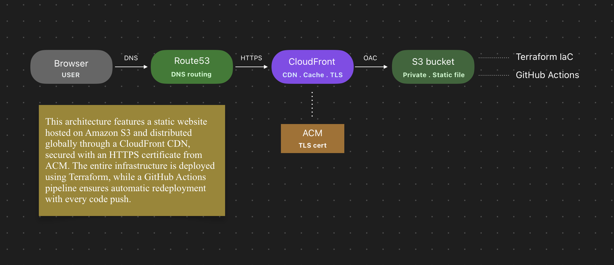

# Personal Portfolio — Hosted on AWS

**Live site:** https://d2eeybsp9y6gvd.cloudfront.net &nbsp;·&nbsp; **Author:** [devgershon](https://github.com/devgershon)

This is my personal portfolio site, but the infrastructure behind it is the real project. The site itself is a single HTML page. What I wanted to build was a proper, production-style AWS deployment: private S3 bucket, global CDN, HTTPS, infrastructure as code, and a CI/CD pipeline that deploys on every push to main. No clicking around in the console, no manual uploads after the first time.

It took about two weeks to get right, balanced alongside full-time work. Here is how it all fits together.

---

## Architecture



```
Browser -> CloudFront (CDN + HTTPS) -> S3 (private bucket)
                  |
          ACM Certificate (us-east-1)

Everything provisioned by Terraform.
Every deploy triggered by GitHub Actions.
```

| Service | What it does here |
|---|---|
| **S3** | Stores the static files. The bucket is fully private with no public access at all. |
| **CloudFront** | Serves the site from AWS edge locations worldwide. Handles HTTPS and caching. |
| **ACM** | Provides the TLS certificate for HTTPS. Has to live in `us-east-1` -- more on that below. |
| **Origin Access Control** | Lets CloudFront read from the private S3 bucket using SigV4 signing. Nothing else can. |
| **Terraform** | Every resource above is defined as code. Nothing was created by hand in the console. |
| **GitHub Actions** | Syncs files to S3 and clears the CloudFront cache on every push to `main`. |

---

## Why not just use a public S3 bucket?

The simplest way to host a static site on S3 is to make the bucket public. It works, but there are two problems with it. First, anyone can bypass CloudFront and hit the bucket directly over plain HTTP, which means no HTTPS and no CDN. Second, you lose control over how and where the content is accessed.

Keeping the bucket private and routing everything through CloudFront via Origin Access Control is a small amount of extra configuration, but it is the correct way to do it and what you would see in a real production setup.

---

## Repo structure

```
aws-static-site/
├── terraform/
│   ├── main.tf          # Provider config, primary region + us-east-1 alias for ACM
│   ├── variables.tf     # Bucket name, region, domain, price class
│   ├── s3.tf            # Bucket, versioning, encryption, OAC, bucket policy
│   ├── cloudfront.tf    # Distribution, cache behaviour, HTTPS, error pages
│   ├── acm.tf           # TLS certificate and DNS validation
│   ├── route53.tf       # DNS records (not used here, CloudFront URL instead)
│   └── outputs.tf       # Prints CloudFront URL, bucket name, distribution ID
├── website/
│   ├── index.html       # The portfolio site
│   └── architecture-diagram1.png
├── .github/
│   └── workflows/
│       └── deploy.yml   # CI/CD pipeline
└── README.md
```

---

## Want to deploy this yourself?

This section is for anyone who wants to clone this repo and run their own version of the same setup. You will need an AWS account (free tier is enough), the AWS CLI, Terraform, and Git installed on your machine.

### 1. Clone the repo

```bash
git clone https://github.com/devgershon/aws-static-site.git
cd aws-static-site
```

### 2. Set your variables

Open `terraform/variables.tf` and update three values:

```hcl
variable "bucket_name" {
  default = "your-name-portfolio-static-site"  # must be globally unique across all of AWS
}

variable "aws_region" {
  default = "eu-west-2"  # change to your preferred region
}

variable "domain_name" {
  default = ""  # leave empty to use the free CloudFront URL, or add your domain
}
```

### 3. Configure your AWS credentials

```bash
aws configure
# Enter your Access Key ID, Secret Access Key, and region when prompted
```

If you do not have an IAM user yet, create one in the AWS console under IAM, attach `AmazonS3FullAccess` and `CloudFrontFullAccess`, then generate an access key under Security credentials.

### 4. Deploy the infrastructure

```bash
cd terraform
terraform init
terraform apply
```

Terraform will show you a full plan of the 8 resources it is going to create. Review it and type `yes` to confirm. The whole thing takes about 3 minutes. When it finishes you will see:

```
cloudfront_url             = "https://your-distribution.cloudfront.net"
s3_bucket_name             = "your-bucket-name"
cloudfront_distribution_id = "EXXXXXXXXXXXX"
```

Save these three values -- you will need them in the next steps.

### 5. Upload the website files

```bash
cd ..
aws s3 sync ./website s3://your-bucket-name --delete
```

Your site is now live at the CloudFront URL above.

### 6. Set up automated deploys

To have GitHub Actions deploy automatically on every push, add these five secrets to your repo under `Settings -> Secrets and variables -> Actions -> New repository secret`:

| Secret name | Where to get the value |
|---|---|
| `AWS_ACCESS_KEY_ID` | Your IAM user access key |
| `AWS_SECRET_ACCESS_KEY` | Your IAM user secret key |
| `S3_BUCKET_NAME` | From `terraform output s3_bucket_name` |
| `CLOUDFRONT_DISTRIBUTION_ID` | From `terraform output cloudfront_distribution_id` |
| `CLOUDFRONT_DOMAIN` | Your CloudFront domain without `https://` |

From this point, every push to `main` syncs the files and invalidates the CloudFront cache. Changes are live in about 30 seconds.

---

## What I actually learned building this

**The ACM us-east-1 requirement is not obvious.** CloudFront only accepts TLS certificates from the N. Virginia region, regardless of where your other resources live. My S3 bucket and CloudFront distribution live in `eu-west-2`. The fix in Terraform is a second provider alias pointing at `us-east-1` just for the certificate resource, but working out why the certificate was not being accepted took longer than expected.

**OAC and OAI are not the same thing, and most tutorials use the wrong one.** Origin Access Control is the current recommended way to secure S3 access from CloudFront. The older approach, Origin Access Identity, is still functional but has been superseded. Most tutorials and Stack Overflow answers still show OAI. Getting OAC wired up with the correct bucket policy took a few attempts.

**IAM credential errors can be misleading.** Running `aws sts get-caller-identity` threw an `InvalidClientTokenId` error on the first attempt. The keys were valid. A character had been pasted incorrectly during `aws configure`. Simple fix, but easy to lose time to if you assume the keys themselves are the problem.

---

## Cost

For a personal portfolio with normal traffic this runs at effectively $0 per month on the AWS free tier.

| Service | Free tier |
|---|---|
| S3 | 5 GB storage, 20,000 GET requests per month |
| CloudFront | 1 TB data transfer, 10 million requests per month |
| ACM | Free when used with AWS services |

---

## Part of a series

This is the first in a set of AWS projects covering the core pillars of cloud engineering.

| # | Project | Stack | Status |
|---|---|---|---|
| 1 | **Static site on AWS** | S3, CloudFront, ACM, Terraform, GitHub Actions | Live |
| 2 | Serverless REST API | Lambda, API Gateway, DynamoDB, IAM, Terraform | Coming soon |
| 3 | Containerised app + CI/CD | Docker, ECR, ECS Fargate, GitHub Actions | Planned |
| 4 | Production VPC architecture | VPC, subnets, NAT, ALB, EC2, RDS, Terraform | Planned |

---

## Contact

[devgershon@gmail.com](mailto:devgershon@gmail.com) &nbsp;·&nbsp; [github.com/devgershon](https://github.com/devgershon) &nbsp;·&nbsp; [linkedin.com/in/gershonen](https://www.linkedin.com/in/gershonen/)
